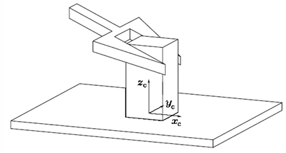
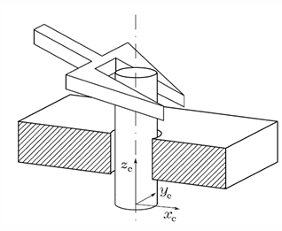
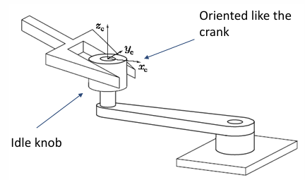

<!-- Link external JavaScript file -->
<script src="questions.js"></script>

# Force control {#start}

<a name="top"></a>

<style>
  #back-to-top {
    position: fixed;
    bottom: 30px;
    right: 30px;
    background-color:rgb(0, 0, 0); /* Green background */
    color: white;
    border: none;
    padding: 10px 15px;
    border-radius: 50%;
    font-size: 30px;
    cursor: pointer;
    text-decoration: none;
    z-index: 1000;
    opacity: 0.7;
    transition: opacity 0.3s ease;
  }

  #back-to-top:hover {
    opacity: 1;
  }
</style>

<a href="#top" id="back-to-top" title="Back to Top">🔝​</a>


- Table of Contents
{:toc}

## Prerequisites
* Linear Algebra and multivariable calculus
* Classical mechanics
* Control theory:
  - First- and second-order system response
  - Proportional, integral and derivative control
  - Transfer functions and feedback
* Basic Robotics
  - Joint-space vs. task-space 
  - Kinematics and dynamics

# Motivation

><sub>*Northwestern Robotics (2018) Modern Robotics, Chapter 11.1: Control System Overview. YouTube video, 16 March. Available at: https://www.youtube.com/watch?v=mGuDXlZEoSc*</sub>
>
><sub>*Lynch, K.M. and Park, F.C. (2017) Modern Robotics: Mechanics, Planning, and Control. Cambridge: Cambridge University Press.*</sub>

In **motion control** problems, the robot's objective is to follow a predefined trajectory as accurately as possible — regardless of contact with the environment. This is suitable for free-space movements where external forces are negligible or undesirable. While the premise of motion control might be basic in nature, it is a fundamental part of any higher-level robot manipulation. 

However, motion control alone is not sufficient when a robot physically interacts with its environment. Indeed unregulated contact can cause slippage, loss of contact, damage and excessive force.  This is where **force control** becomes essential: it ensures that the robot applies and regulates the desired amount of force during contact, making the interaction both safe and effective. A force control strategy modifies the robot's joint positions or torques to account for interaction forces at the end-effector.

This is why, in the past decade, research in robot force control has increased significantly, with applications across medical, industrial and service robotics. In industrial robotics, typical tasks that involves robot interaction with an environment such as polishing, cutting, scraping, pick-and-place, welding, etc. can benefit from the use of different methods of force control strategies. 
Another particularly impactful area is physical human-robot interaction, where the robot must respond to human-applied forces and work in synchrony. In these scenarios, force control enables safe, adaptive and cooperative behavior in shared tasks.

<details markdown="1">
<summary><strong>Conceptual Exercise</strong></summary>
**Drag each task to the correct category:**

<style>
  .drag-container {
    display: flex;
    flex-wrap: wrap;
    gap: 12px;
    margin-bottom: 16px;
  }

  .drop-zone {
    border: 2px dashed #ccc;
    border-radius: 6px;
    padding: 10px;
    min-height: 175px;
    width: 45%;
    background-color: #f9f9f9;
  }

  .drag-item {
    background-color: #e3e3e3;
    padding: 8px 12px;
    border-radius: 4px;
    cursor: move;
    user-select: none;
    margin: 4px;
  }

  .check-button {
    margin-top: 10px;
    padding: 8px 12px;
    cursor: pointer;
  }

  .feedback {
    margin-top: 10px;
    font-weight: bold;
  }
</style>

<div class="drag-container">
  
  <!-- Serial Robot Zone -->
  <div class="drop-zone" id="motion-zone" ondrop="drop(event)" ondragover="allowDrop(event)">
    <h3>Motion Control</h3>
  </div>

  <!-- Parallel Robot Zone -->
  <div class="drop-zone" id="force_zone" ondrop="drop(event)" ondragover="allowDrop(event)">
    <h3> Force Control</h3>
  </div>
</div>

<!-- Draggable items -->
<div class="drag-container" id="drag-items">
  <div class="drag-item" id="pick_place" draggable="true" ondragstart="drag(event)">Pick-and-place in free space</div>    <div class="drag-item" id="Peg_in_hole" draggable="true" ondragstart="drag(event)">Peg-in-hole assembly</div>
  <div class="drag-item" id="Wiping" draggable="true" ondragstart="drag(event)">Wiping a window</div>
  <div class="drag-item" id="3D_print" draggable="true" ondragstart="drag(event)">3D printing</div>
  <div class="drag-item" id="Drone" draggable="true" ondragstart="drag(event)">Flying a drone for inspection</div>
  <div class="drag-item" id="Polishing" draggable="true" ondragstart="drag(event)">Surface polishing</div>
  <div class="drag-item" id="hand_shaking" draggable="true" ondragstart="drag(event)">Human handshaking robot </div>
</div>

<script>
const correctMapping = {
  "motion-zone": ["pick_place", "3D_print", "Drone"],
  "force_zone": ["Peg_in_hole", "Polishing", "hand_shaking", "Wiping"]
};
</script>

<!-- Trigger + Feedback -->
<button class="check-button" onclick="checkDragDropAnswer(correctMapping, 'feedback-drag')">Check Answer</button>
<div class="feedback" id="feedback-drag"></div>


<details markdown ="1">
  <summary><strong>Detailed answer</strong></summary>

  * **Force control :**
    - Peg-in-hole assembly : without force control, the peg might jam or break if misaligned; force control lets the robot feel contact and adjust insertion force to guide it in. 
    - Surface polishing : a position-only robot might either press too hard (damaging the surface/tool) or too lightly (ineffective polishing); force control maintains a consistent polishing pressure. 
    - Human handshaking robot : purely position-controlled handshake could crush the person’s hand or miss it entirely, whereas force control allows gentle, adaptive gripping. 
    - Wiping a table or window : Maintaining consistent contact pressure across a surface is difficult with pure motion control; uneven force leads to missed spots or excess wear.

  * **Motion control :**
    - Pick-and-place in free space : If there’s no contact with the environment during transit, motion control ensures fast, smooth, and precise movement.
    - 3D printing : The tool follows a precisely planned trajectory to deposit material. Contact with the environment is minimal and highly predictable.
    - Flying a drone for inspection : Drones typically avoid contact; path following through motion control is sufficient for inspection unless manipulation is involved.

  → Force control prevents excessive force and adapts to uncertainties in contact

</details>

</details>

# Chapter 1 : Interaction control overview
While motion control focuses on following a desired trajectory regardless of external contact, force control aims to regulate how much force is exchanged between the robot and its environment. This raises a fundamental question: how does the robot respond to forces during contact? There are two broad paradigms for addressing this:

* **Passive interaction control**: The trajectory of the end-effector is driven by the interaction forces due to the inherent nature or compliance of the robot (i.e., internally, such as joints, servo, joints, etc.). In passive control, the end-effector’s motion naturally deflects under force, as in soft robots. But, this lacks flexibility (every specific task might require a special end-effector to be designed and it can also have position and orientation deviations)​ and high contact forces could occur because there is no force measurement. 
<details markdown="1">
<summary><strong>Illustrative example</strong></summary>

<iframe width="560" height="315" src="https://www.youtube.com/embed/9ncqptpXT8w?start=47&amp;end=60" frameborder="0" allow="accelerometer; autoplay; encrypted-media; gyroscope; picture-in-picture" allowfullscreen></iframe>

> <sub>*Arun Dayal Udai, Abdullah Aamir Hayat and Subir Kumar Saha, "Parallel Active/Passive Force Control of Industrial Robots with Joint Compliance," IEEE/RSJ International Conference on Intelligent Robots and Systems (IROS 2014), Chicago, IL, Sept. 14-18, 2014, pp: 4511 - 4516.*</sub>
>
> *This video, starting from 47s, clearly presents how the robot’s end-effector deflects naturally in response to external forces, showcasing the principle of passive interaction control, where the robot's compliance governs its motion without active force regulation.*
</details>

* **Active interaction control**: It relies on sensors (e.g., force/torque sensors) and/or feedback controllers to measure interaction forces and adjust the robot’s commands accordingly—whether by modifying its trajectory or the way it manipulates objects. This approach enables real-time reactions to contact, offering high flexibility and accuracy. However, it comes with added complexity and limitations in speed. To achieve effective task execution and robust disturbance rejection, active control is typically combined with some degree of passive compliance. Active strategies can be futer divided into indirect methods (such as admittance and impedance control) and direct force control techniques (such as hybrid force/motion control).

<details markdown="1">
<summary><strong>Illustrative example</strong></summary>  

	
> <sub>*Bodie, K., Brunner, M., Pantic, M., Walser, S., Pfändler, P., Angst, U., and Nieto, J., 2020. Active interaction force control for contact-based inspection with a fully actuated aerial vehicle. IEEE Transactions on Robotics, 37(3), pp.709–722.*</sub>
>
> *This video provides an intuitive demonstration of active interaction force control. Pay attention to how sensors and feedback controllers allow the robot to adjust its actions in real time based on the forces it experiences. These concepts, including different active control strategies, will be explored in greater detail throughout the course.*
</details>

<details markdown = "1">
  <summary><strong>Conceptual exercise</strong></summary>
**What is the difference between passive and active interaction control?**

<style>
  .drag-container {
    display: flex;
    flex-wrap: wrap;
    gap: 12px;
    margin-bottom: 16px;
  }

  .drop-zone {
    border: 2px dashed #ccc;
    border-radius: 6px;
    padding: 10px;
    min-height: 150px;
    width: 45%;
    background-color: #f9f9f9;
  }

  .drag-item {
    background-color: #e3e3e3;
    padding: 8px 12px;
    border-radius: 4px;
    cursor: move;
    user-select: none;
    margin: 4px;
  }

  .check-button {
    margin-top: 10px;
    padding: 8px 12px;
    cursor: pointer;
  }

  .feedback {
    margin-top: 10px;
    font-weight: bold;
  }
</style>

<div class="drag-container">
  
  <!-- Serial Robot Zone -->
  <div class="drop-zone" id="passive_zone" ondrop="drop(event)" ondragover="allowDrop(event)">
    <h3>Passive interaction control</h3>
  </div>

  <!-- Parallel Robot Zone -->
  <div class="drop-zone" id="active_zone" ondrop="drop(event)" ondragover="allowDrop(event)">
    <h3>Active interaction control</h3>
  </div>
</div>

<!-- Draggable items -->
<div class="drag-container" id="drag-items_passive_active">
 <div class="drag-item" id="item1" draggable="true" ondragstart="drag(event)">Does not measure force</div>
  <div class="drag-item" id="item2" draggable="true" ondragstart="drag(event)">Measures contact force and moment using sensors</div>
  <div class="drag-item" id="item3" draggable="true" ondragstart="drag(event)">Simple and inexpensive to implement</div>
  <div class="drag-item" id="item4" draggable="true" ondragstart="drag(event)">Uses feedback control to actively regulate force</div>
  <div class="drag-item" id="item5" draggable="true" ondragstart="drag(event)">Performance limited by mechanical design</div>
    <div class="drag-item" id="item9" draggable="true" ondragstart="drag(event)">Provides fast response but limited adaptability</div>

<div class="drag-item" id="item6" draggable="true" ondragstart="drag(event)">Can be programmed for precise and variable force outputs</div>
  <div class="drag-item" id="item7" draggable="true" ondragstart="drag(event)">Cannot adapt trajectory during execution; only tolerates small deviations</div>
  <div class="drag-item" id="deforms" draggable="true" ondragstart="drag(event)">Deforms passively under contact</div>
  <div class="drag-item" id="item11" draggable="true" ondragstart="drag(event)">Cannot guarantee prevention of high contact forces</div>

  <div class="drag-item" id="item8" draggable="true" ondragstart="drag(event)">Typically more complex and costly</div>
  <div class="drag-item" id="item10" draggable="true" ondragstart="drag(event)">Slower due to sensing and control computation</div>
</div>

<script>
const correctMapping2 = {
  "passive_zone": ["item1", "item3", "item5", "item7", "deforms", "item9", "item11"],
  "active_zone": ["item2", "item4", "item6", "item8", "item10"]
};
</script>

<!-- Trigger + Feedback -->
<button class="check-button" onclick="checkDragDropAnswer(correctMapping2, 'feedback-passive_active')">Check Answer</button>
<div class="feedback" id="feedback-passive_active"></div>

</details>

### Mathematical Foundation
*Note: The following builds upon the equation derived in the Dynamics chapter of this course.* 

$$
\boldsymbol{\tau} = \boldsymbol{M}(\boldsymbol{\theta}) \ddot{\boldsymbol{\theta}} + \boldsymbol{C}(\boldsymbol{\theta}, \dot{\boldsymbol{\theta}}) \dot{\boldsymbol{\theta}} + \boldsymbol{g}(\boldsymbol{\theta}) + \boldsymbol{J}^T(\boldsymbol{\theta}) \boldsymbol{F}_{\text{ee}}
$$

*Ensure that the meaning of each term is clearly understood before engaging in this section.*


><sub>*Northwestern Robotics (2018) Modern Robotics, Chapter 11.5: Force Control. YouTube video, 16 March. Available at: https://www.youtube.com/watch?v=M1U629sREiY*</sub>
>
><sub>*Lynch, K.M. and Park, F.C. (2017) Modern Robotics: Mechanics, Planning, and Control. Cambridge: Cambridge University Press.*</sub>

At a quasi-static level (i.e., for slow or stationary motions $\ddot{\boldsymbol{\theta}} = 0$ and $\dot{\boldsymbol{\theta}} = 0$), the joint torques $\boldsymbol{\tau}$ are related to the end-effector contact force $\boldsymbol{F_{\text{tip}}}$ by the following fundamental equation:

$$
\boldsymbol{\tau} = \boldsymbol{g}(\boldsymbol{\theta}) + \boldsymbol{J}^T(\boldsymbol{\theta}) \boldsymbol{F_{\text{tip}}}
$$

where:
- $\boldsymbol{\tau} \in \mathbb{R}^m$ is the vector of joint torques (units: $\mathrm{Nm}$), where $m$ is the number of robot joints.
- $\boldsymbol{g}(\boldsymbol{\theta}) \in \mathbb{R}^m$ is the vector of joint torques required to counteract gravity at configuration $\boldsymbol{\theta}$ (units: $\mathrm{Nm}$).
- $\boldsymbol{J}(\boldsymbol{\theta}) \in \mathbb{R}^{n \times m}$ is the manipulator Jacobian, mapping joint velocities (units: $\mathrm{rad/s}$) to end-effector velocities (units: $\mathrm{m/s}$ and/or $\mathrm{rad/s}$), where:
- $\boldsymbol{F_{\text{tip}}} \in \mathbb{R}^n$ is the force and moment (wrench) applied at the end-effector (units: $\mathrm{N}$ for forces, $\mathrm{Nm}$ for moments).

*Note that through the whole course:*
  - *$n$ is the number of task-space dimensions (e.g., $n=6$ in 3D Cartesian space, $n=2$ in planar tasks or $n=3$ if the rotation around the $z$-axis is considered)*
  - *$m$ is the number of robot joints.*

This relationship holds for both types of interaction control, but the way it is used differs:

- In **passive interaction control**, $\boldsymbol{F_{\text{tip}}}$ is imposed by the environment, and the resulting motion depends on the robot’s intrinsic compliance.
- In **active interaction control**, this equation becomes a control law: we specify a desired contact force $\boldsymbol{F_d}$ and compute the torque needed to apply it:

$$
\boldsymbol{\tau} = \tilde{\boldsymbol{g}}(\boldsymbol{\theta}) + \boldsymbol{J}^T(\boldsymbol{\theta}) \boldsymbol{F_d}
$$

where:
- $\tilde{\boldsymbol{g}}(\boldsymbol{\theta}) \in \mathbb{R}^n$ is a model-based estimate of gravitational torques.

This corresponds to **open-loop force control**: it assumes the robot's model and the environment are accurate. However, because models are never perfect, this method is sensitive to disturbances and uncertainties.

To improve robustness, **feedback** is introduced — typically using a PI (Proportional-Integral) controller:

$$
\boldsymbol{\tau} = \tilde{\boldsymbol{g}}(\boldsymbol{\theta}) + \boldsymbol{J}^T(\boldsymbol{\theta}) \left( \boldsymbol{F_d} + \boldsymbol{K_p} \boldsymbol{F_e} + \boldsymbol{K_i} \int \boldsymbol{F_e}\, dt \right)
$$

where:
- $\boldsymbol{K_p} \in \mathbb{R}^{n\times n}$ is the proportional gain matrix
- $\boldsymbol{K_i} \in \mathbb{R}^{n\times n}$ is the integral gain matrix
- $\boldsymbol{F_e} = \boldsymbol{F_d} - \boldsymbol{F_{\text{tip}}} \in \mathbb{R}^n$ is the force error (units: $\mathrm{N}$ for forces, $\mathrm{Nm}$ for moments).


This feedback formulation allows the robot to adjust its torques based on measured force errors, improving stability and accuracy even as the environment changes.


<details markdown = "1">
<summary><strong>Mathematical exercise</strong></summary>

**EXERCISE 1:**
<form id="q-interaction">
  <input type="radio" name="q-interaction" value="a"> In <strong>active interaction control</strong>, the robot controls the <strong>desired force</strong> $F_d$, and the actual force $F_{\text{tip}}$ is the result of the robot’s actions<br>
  <input type="radio" name="q-interaction" value="b"> In <strong>passive interaction control</strong>, the robot controls the actual force $F_{\text{tip}}$, and the desired force $F_d$ is imposed by the environment.<br>
  <input type="radio" name="q-interaction" value="c"> In <strong>both passive and active interaction control</strong>, the robot controls the desired force $F_d$, and the actual force $F_{\text{tip}}$ is simply a consequence of the environment.<br>
  <input type="radio" name="q-interaction" value="d"> In <strong>both passive and active interaction control</strong>, the robot controls $F_{\text{tip}}$, and the desired force $F_d$ is an abstract goal that is not directly controlled. <br><br>

  <button type="button" onclick="checkMCQ('q-interaction', 'a', 
    'Correct! Good job!', 
    'Incorrect. Try again!')">
    Check Answer
  </button>

  <p id="q-interaction-feedback"></p>
</form>
<br>

**EXERCISE 2:**

Consider a robotic arm operating in a 2D plane. The Jacobian matrix $\boldsymbol{J}(\boldsymbol{\theta})$ at a given configuration is:

$$
\boldsymbol{J}(\boldsymbol{\theta}) = \begin{bmatrix} 
1 & 2 \\ 
0 & 1 
\end{bmatrix}
$$

where:
- $\boldsymbol{J}(\boldsymbol{\theta}) \in \mathbb{R}^{2\times2}$ maps joint velocities (units: $\mathrm{rad/s}$) to end-effector linear velocities (units: $\mathrm{m/s}$).

Two scenarios are considered:

- **Scenario A: Active Interaction Control**  
  The robot must apply a desired end-effector force:  
  $$\boldsymbol{F_d} = \begin{bmatrix} 3 \\ 1 \end{bmatrix} \, \mathrm{N}$$

- **Scenario B: Passive Interaction Control**  
  The environment imposes an external force measured at the end-effector:  
  $$\boldsymbol{F_{\text{tip}}} = \begin{bmatrix} 2 \\ 0.5 \end{bmatrix} \, \mathrm{N}$$

Assume that the model of gravitational torques is zero, i.e., $\tilde{\boldsymbol{g}}(\boldsymbol{\theta}) = \boldsymbol{0}$.

**Task:** Compute the joint torques $\boldsymbol{\tau}$ in both scenarios.

<details markdown="1">
<summary><strong>Solution</strong></summary>

- **Scenario A: Active Interaction Control**

First, compute the transpose of the Jacobian:

$$
\boldsymbol{J}^T(\boldsymbol{\theta}) = \begin{bmatrix} 
1 & 0 \\ 
2 & 1 
\end{bmatrix}
$$

Then, compute the joint torques using:

$$
\boldsymbol{\tau} = \boldsymbol{J}^T(\boldsymbol{\theta}) \boldsymbol{F_d}
$$

Substituting $\boldsymbol{F_d}$:

$$
\boldsymbol{\tau} = \begin{bmatrix} 
1 & 0 \\ 
2 & 1 
\end{bmatrix} \begin{bmatrix} 3 \\ 1 \end{bmatrix}
$$

Thus, the joint torques for **Scenario A** are:
$$
\boldsymbol{\tau} = \begin{bmatrix} 1 \times 3 + 0 \times 1 \\ 2 \times 3 + 1 \times 1 \end{bmatrix} = \begin{bmatrix} 3 \\ 7 \end{bmatrix}\, \mathrm{N\cdot m}
$$

- **Scenario B: Passive Interaction Control**

Again, using:

$$
\boldsymbol{\tau} = \boldsymbol{J}^T(\boldsymbol{\theta}) \boldsymbol{F_{\text{tip}}}
$$

Substituting $\boldsymbol{F_{\text{tip}}}$:

$$
\boldsymbol{\tau} = \begin{bmatrix} 
1 & 0 \\ 
2 & 1 
\end{bmatrix} \begin{bmatrix} 2 \\ 0.5 \end{bmatrix}
$$

Thus, the joint torques for **Scenario B** are:

$$
\boldsymbol{\tau} = \begin{bmatrix} 1 \times 2 + 0 \times 0.5 \\ 2 \times 2 + 1 \times 0.5 \end{bmatrix} = \begin{bmatrix} 2 \\ 4.5 \end{bmatrix} \, \mathrm{N\cdot m}
$$


**Conclusion:** The purpose of this exercise is to show that the calculations governing passive and active interaction control are similar, what changes is how the force is interpreted. For active interaction control, it's a force that we desire to achieve whereas, for passive interaction control, it's a force imposed by the environment.
</details>

</details>


# Chapter 2: Active interaction control
Active interaction control strategies can be grouped into two categories: those performing indirect force control and those performing direct force control. The main difference is that indirect methods regulate interaction forces through motion behaviors without explicitly closing a force feedback loop whereas direct force control explicitly commands and tracks contact forces through sensor-based feedback.

## Chapter 2.1 : Indirect Force Control

Indirect force control strategies achieve force regulation by modulating the robot’s motion response rather than directly commanding forces. The robot behaves like a virtual mechanical system (typically a mass-spring-damper) so that when it is pushed, it responds with motion that generates restoring forces, just like a compliant structure would. 

In this approach, we are not controlling nor tracking the force directly. Instead, we are controlling how the robot moves when it encounters a force, which in turn determines the contact force. This behavior is what enables impedance and admittance control.

Imagine pressing on the end-effector of a robot. With only knowledge of the robot’s own parameters - i.e. not the properties of the environment, we can design a controller so that the robot responds as if you were pushing against a virtual spring-mass-damper system, not because it's tracking a specific force, but because its motion is governed by a virtual dynamic behavior that generates restoring forces naturally. Rather than rigidly following a trajectory, the controller modulates the system’s virtual dynamics (e.g., stiffness, damping) and lets the compliant behavior manage contact.

<details markdown="1">
<summary><strong>Illustrative example</strong></summary>


><sub>*Harmonic Bionics (2021) Impedance Control vs. Position Control. YouTube video, 20 April. Available at: https://youtu.be/KJ8s1BUHoks*</sub>
>
> *Notice how the position-controlled arm is stiff, rigid and challenging to interrupt. It completes the movement, as programmed, with little distraction from the human attempting to disrupt the intended path of movement. Meanwhile, the same disruptions (force and direction) are applied to the impedance-controlled arm. Notice how it ‘gives in’ to these forces in a soft, spring-like manner and can easily be disrupted from completing the movement.* 

This approach has powerful advantages:
- It provides intuitive and robust interaction with unknown environments.
  *If the right arm in the video unexpectedly hits a wall, it adapts and moves compliantly, avoiding damage. The left arm would crash into it rigidly which might be very dangerous.*
- It is robust to modeling errors and external disturbances.
 *When the human pushes the right arm, it smoothly adjusts. Even if friction or force models are wrong, it stays stable, unlike the stiff left arm.*
- If both the robot and the environment behave like passive (dissipative) systems, the overall interaction remains stable. 
*When pushed, the right arm and the human’s hand both yield softly, keeping the motion smooth and stable.*

</details>

<!--- THIS PART WAS REMOVED UNTIL FURTHER WORK (NEED TO EXPLAIN PASSSIVITY....) !!!!
<details markdown = "1">
<summary><em>Stability of passive systems</em></summary>

If you're unfamiliar with what it means for a system to be passive, this short video offers a helpful intuition. The key point, lying between the *6:30* and *10:30mn*, is that a passive system can’t generate energy on its own, it can only dissipate or store it. In the context of force control, this matters because when two passive systems are connected through feedback, as is often the case when a robot interacts with its environment, the total energy in the closed-loop system remains bounded, which ensures stabilit of the overall system. This principle explains why impedance and admittance control strategies, which render the robot passive, are inherently robust even in the face of modeling uncertainties or unknown contact conditions
</details>
-->

**What does it really mean for a robot to “behave like a spring-mass-damper" ?**


><sub>*Gesta, A. (2022) POLAR SkillShare 4 – Impedance Control for Robotic Rehabilitation. YouTube video, 29 July. Available at: https://www.youtube.com/watch?v=Vz5c3il0Dys*</sub>
>
> *This short video by Polytech Montréal gives a concise and intuitive introduction to these concepts. It explores the dynamic relationship between force and motion, and shows how this relationship — known as **mechanical impedance** — underlies both impedance and admittance control. If you're unfamiliar with these terms, watch this first — it sets the stage for what follows.*

### Chapter 2.1.1: Mechanical Impedance - the shared foundation
At the core of both impedance and admittance control lies the idea of **mechanical impedance**. It describes how a physical system resists motion when subjected to a force. Unlike static stiffness (which links force to displacement), impedance captures **dynamic behavior**, i.e. how velocity (or acceleration) influences the force a system generates or absorbs.

Mathematically, **impedance** $\boldsymbol{Z}$ defines a dynamic relationship between the **force** $\boldsymbol{F}$ and the **velocity** $\boldsymbol{v}$:

$$
\boldsymbol{F} = \boldsymbol{Z} \, \boldsymbol{v}
$$

Depending on the desired dynamic behavior, $\boldsymbol{Z}(s)$ may represent different physical components:

- **Inertial response (mass)**: $\boldsymbol{F} = \boldsymbol{M}  \boldsymbol{a}$

- **Elastic response (Hooke's law)**: $\boldsymbol{F} = \boldsymbol{K} \boldsymbol{x}$

- **Damping behavior**: $\boldsymbol{F} = -\boldsymbol{B} \boldsymbol{v}$

In practice, robots are modeled as a combination of these components.

What’s important is that we’re not just controlling position or force directly, we’re shaping how the robot behaves when interacting with the environment. By making the robot behave like a particular mechanical system (e.g., a stiff spring, a soft damper, or a heavy object), we get force behavior *for free* as a result of motion.

From this shared foundation, two distinct approaches emerge:
- In **impedance control**, we specify the mechanical impedance and **generate force** in response to motion.
- In **admittance control**, we specify the inverse behavior — the mechanical admittance — and **generate motion** in response to force.

### Chapter 2.1.2 : Impedance control

Impedance control is a strategy where the robot is made to replicate the behaviour of a mechanical system, usually a combination of **mass, spring, and damper**, designed to resist motion when subjected to a force. We do not directly command the contact force, but rather define how the robot should respond when force is applied to it by dynamically adjusting the virtual inertia, damping and stiffness of the robot

<figure>
  
  <figcaption><center><em>A simple one-DOF impedance-controlled system. In the rest of the chapter $X_d$ will be refered as $\boldsymbol{x_r}$ and $X_m$ as $\boldsymbol{x}$. The interaction creates an external force $\boldsymbol{f_{\text{ext}}}$</em><br><sub>Shiferaw, T. (2025) Advanced robotic manipulation with impedance control. MathWorks. Available at: https://ch.mathworks.com/company/technical-articles/enhancing-robot-precision-and-safety-with-impedance-control.html</sub></center> </figcaption>
</figure>

This desired behavior is formalized by the following second-order differential equation:

$$
\boldsymbol{M_d} \ddot{\boldsymbol{x}} + \boldsymbol{B_d} \dot{\boldsymbol{x}} + \boldsymbol{K_d}(\boldsymbol{x} - \boldsymbol{x_r}) = \boldsymbol{f_{\text{ext}}}
$$

where:
- $\boldsymbol{x} \in \mathbb{R}^n$ is the end-effector position (units: $\mathrm{m}$),
- $\boldsymbol{x_r} \in \mathbb{R}^n$ is the reference trajectory (units: $\mathrm{m}$),
- $\boldsymbol{M_d} \in \mathbb{R}^{n \times n}$ is the desired virtual mass matrix (units: $\mathrm{kg}$),
- $\boldsymbol{B_d} \in \mathbb{R}^{n \times n}$ is the desired virtual damping matrix (units: $\mathrm{Ns/m}$),
- $\boldsymbol{K_d} \in \mathbb{R}^{n \times n}$ is the desired virtual stiffness matrix (units: $\mathrm{N/m}$),
- $\boldsymbol{f_{\text{ext}}} \in \mathbb{R}^n$ is the external force exerted by the environment (units: $\mathrm{N}$).

This equation describes how the robot should react to forces. For example:
- A high stiffness ($\boldsymbol{K_d}$) makes the robot stiffer, resisting deviations from $\boldsymbol{x_r}$.
- A high damping ($\boldsymbol{B_d}$) smooths out motion and reduces vibrations.
- A high inertia ($\boldsymbol{M_d}$) makes the robot less sensitive to sudden external disturbances.

The system doesn’t track force, the force arises naturally through this interaction law. Hence, by controlling the impedance of the robot we can manipulate the behavior of the end-effector depending on the interaction with the environment. For example, we can set very low impedance (or high compliance) and make it act like a very loose spring which is useful in physical human-robot interaction or we can set the stiffness very high where the robot would only move to the desired position without much oscillation which is important for precise industrial tasks.

<details markdown="1">
<summary><strong>Illustrative example</strong></summary>


><sub>*EESCRobManLab (2012) Impedance Control: Impedance Control Tests Performed on a Linear Axis. YouTube video, 20 June. Available at: https://www.youtube.com/watch?v=WS1gSRcJbJQ*</sub>
>
>*This video demonstrates impedance control in action: the robot behaves like a virtual mass-spring-damper system. Notice how the arm remains compliant to external perturbations and can even land safely on a fragile object like a potato chip without breaking it. The different experiences show how we achieve precise force control indirectly through the desired mechanical behavior by adjusting the dynamic relationship between force and motion through impedance control.*
</details>

<details markdown ="1">
<summary><strong>Mathematical exercise</strong></summary>

You observe that the robot reacts too violently to small sudden forces (sharp perturbations).  
Which **desired virtual impedance parameter** should you increase to smooth out the motion?

<form id="q-impedance">
  <input type="radio" name="q-impedance" value="a_imp"> Increase desired virtual mass $\boldsymbol{M_d}$ (inertia) <br>
  <input type="radio" name="q-impedance" value="b_imp"> Increase desired virtual damping $\boldsymbol{B_d}$ (damping)<br>
  <input type="radio" name="q-impedance" value="c_imp"> Increase desired virtual stiffness $\boldsymbol{K_d}$ (stiffness)<br>
  <input type="radio" name="q-impedance" value="d_imp"> Decrease desired virtual damping $\boldsymbol{B_d}$ (damping) <br>

  <button type="button" onclick="checkMCQ('q-impedance', 'a_imp', 
    'Correct! Good job!', 
    'Incorrect. Try again!')">
    Check Answer
  </button>

  <p id="q-impedance-feedback"></p>
</form>

<details markdown="1">
<summary><strong>Detailed solution</strong></summary>

The impedance model introduced in this course is:
$$
\boldsymbol{f_{\text{ext}}} = \boldsymbol{M_d} \ddot{\boldsymbol{x}} + \boldsymbol{B_d} \dot{\boldsymbol{x}} + \boldsymbol{K_d}(\boldsymbol{x} - \boldsymbol{x_r})
$$
$$
\ddot{\boldsymbol{x}} = \frac{\boldsymbol{f_{\text{ext}}} - \boldsymbol{B_d} \dot{\boldsymbol{x}} - \boldsymbol{K_d}(\boldsymbol{x} - \boldsymbol{x_r})}{\boldsymbol{M_d}}
$$

- Increasing $\boldsymbol{M_d}$ for a given external force **reduces** the resulting acceleration.
- Thus, increasing $\boldsymbol{M_d}$ **smooths out** the robot's reaction to impulsive forces.

**Physical interpretation:**
- Larger virtual mass makes the robot behave as if it is heavier.
- A heavier system accelerates less in response to sudden forces, leading to smoother, less violent reactions.

**What about damping $B_d$?**
- Increasing $\boldsymbol{B_d}$ helps reduce **velocity oscillations** over time (continuous vibrations), not instantaneous accelerations.
- Damping would slow down motion, but it doesn't primarily buffer sharp instantaneous perturbations.

**Summary:**

| Goal | Best Parameter to Adjust |
|:---|:---|
| Reduce violent, sharp reactions (instant accelerations) | **Increase $M_d$** |
| Smooth out continuous velocity oscillations | **Increase $B_d$** |
| Control position deviation under force | **Adjust $K_d$** |

</details>
</details>
<br>

**Stiffness control : a subset of impedance control**

Through impedance control, it is possible to achieve a desired **dynamic** behaviour. A subset of this task is to achieve a **static** behaviour. Instead of specifying how the robot responds dynamically (with mass, damping, and stiffness), we only define a static relationship between the deviation in position/orientation and the force exerted on the environment. This is done by acting on the elements of the stiffness **K** in the impedance model while ignoring inertial and damping terms → **Stiffness control** 

The control law focuses on maintaining a desired position while allowing some compliance, without needing explicit force sensing.
- High stiffness $\boldsymbol{K_d}$ → accurate position tracking, but less compliant
- Low stiffness $\boldsymbol{K_d}$ → more compliant, but allows larger motion deviations under external forces.

This trade-off allows us to limit contact forces and moments, even without a force/torque sensor — simply by choosing the right stiffness. However, in the presence of disturbances (e.g. joint friction), using too low a stiffness may cause the end-effector to deviate significantly from the desired position, even without external contact.


><sub>*ARMLab CU-ICAR (2014) Planar Cable Robot with Variable Stiffness. YouTube video, 15 September. Available at https://www.youtube.com/watch?v=pXH7rwrzh6s*</sub>
>
><sub>*Zhou, X., Jun, S. and Krovi, V. (2014) ‘Planar Cable Robot with Variable Stiffness’, Proceedings of the 2014 International Symposium on Experimental Robotics, Marrakech/Essaouira, Morocco, 15–18 June.*</sub>
>
> *This video illustrates the concept of stiffness control. Observe how a system with high stiffness tracks its desired position more accurately and reacts faster to disturbances, while a compliant (low-stiffness) system shows larger deviations upon collision with an external object. The graph highlights how stiffness influences both the speed and magnitude of the response, an essential trade-off in designing compliant behaviors without direct force sensing.*

<details markdown = "1">
<summary><strong>But how is impedance control actually implemented in a robot? How do we compute the joint torques τ that produce a response matching this desired impedance?</strong></summary>

To implement impedance control, we must first express the robot’s true dynamics in **task space**, where the desired mechanical behavior is defined. 

* **Joint-space dynamics:**

$$
\boldsymbol{\tau} = \boldsymbol{M}(\boldsymbol{\theta}) \ddot{\boldsymbol{\theta}} + \boldsymbol{C}(\boldsymbol{\theta}, \dot{\boldsymbol{\theta}}) \dot{\boldsymbol{\theta}} + \boldsymbol{g}(\boldsymbol{\theta}) + \boldsymbol{J}^T(\boldsymbol{\theta}) \boldsymbol{f}_{\text{ee}}
$$

* **Task-space dynamics:**
We can express the robot's motion in task space using the kinematic relationships:

- $\boldsymbol{\dot{x}} = \boldsymbol{J}(\boldsymbol{\theta}) \dot{\boldsymbol{\theta}}$
- $\boldsymbol{\ddot{x}} = \boldsymbol{J}(\boldsymbol{\theta}) \ddot{\boldsymbol{\theta}} + \dot{\boldsymbol{J}}(\boldsymbol{\theta}, \dot{\boldsymbol{\theta}}) \dot{\boldsymbol{\theta}}$

The task-space dynamics are then given by:
$$
\boldsymbol{\Lambda}(\boldsymbol{\theta}) \ddot{\boldsymbol{x}} + \boldsymbol{\eta}(\boldsymbol{\theta}, \dot{\boldsymbol{x}}) = \boldsymbol{F}_{\text{ee}}
$$

where:
- $\boldsymbol{\Lambda}(\boldsymbol{\theta}) = \left( \boldsymbol{J}(\boldsymbol{\theta}) \boldsymbol{M}^{-1}(\boldsymbol{\theta}) \boldsymbol{J}^T(\boldsymbol{\theta}) \right)^{-1}$ is the task-space inertia matrix,
- $\boldsymbol{\eta}(\boldsymbol{\theta}, \dot{\boldsymbol{x}})$ represents Coriolis, centrifugal, and gravity effects in task space,
- $\boldsymbol{F}_{\text{ee}}$ is the force applied at the end-effector.

---

The key idea to compute the joint torques $\boldsymbol{\tau}$ inducing a response matching this desired impedance is to design a control law that cancels the robot’s internal dynamics and replaces them with the behavior of a virtual mass-spring-damper system. 

To do this, we define a **desired force** at the end-effector:

$$
\boldsymbol{F}_{\text{ee}_d} = \boldsymbol{M_d} \ddot{\boldsymbol{x}} + \boldsymbol{B_d} \dot{\boldsymbol{x}} + \boldsymbol{K_d}(\boldsymbol{x} - \boldsymbol{x_r})
$$

We, then, use an internal model of the robot to cancel its actual task-space dynamics and inject this desired behavior. 

<details markdown ="1">
<summary><em>What is the internal model of a robot?</em></summary>

In the context of impedance control, the **internal model** refers to the controller's estimate of the robot's dynamics, which is used to predict and compensate for the robot’s natural behavior. It is not the actual dynamics of the robot, but rather an approximation based on known or identified parameters.

The internal model typically includes:
* An estimate of the task-space inertia matrix: $\tilde{\boldsymbol{\Lambda}}(\boldsymbol{\theta})$
* An estimate of the Coriolis, centrifugal, and gravitational effects: $\tilde{\boldsymbol{\eta}}(\boldsymbol{\theta}, \dot{\boldsymbol{x}})$

These are computed using internal approximations of:
* The manipulator Jacobian: $\tilde{\boldsymbol{J}}(\boldsymbol{\theta})$
* The joint-space dynamics: $\tilde{\boldsymbol{M}}(\boldsymbol{\theta})$, $\tilde{\boldsymbol{C}}(\boldsymbol{\theta}, \dot{\boldsymbol{\theta}})$, $\tilde{\boldsymbol{g}}(\boldsymbol{\theta})$

---
</details>

The impedance-control algorithm in task-space:
<div>
\[
\boldsymbol{\tau} = \boldsymbol{J}^T(\boldsymbol{\theta}) \left(
\underbrace{\tilde{\boldsymbol{\Lambda}}(\boldsymbol{\theta}) \ddot{\boldsymbol{x}} + 
\tilde{\boldsymbol{\eta}}(\boldsymbol{\theta}, \dot{\boldsymbol{x}})}_{\text{internal model of robot dynamics}}
-
\underbrace{\boldsymbol{M_d} \ddot{\boldsymbol{x}} + 
\boldsymbol{B_d} \dot{\boldsymbol{x}} + 
\boldsymbol{K_d}(\boldsymbol{x} - \boldsymbol{x_r})}_{\text{desired impedance behavior}}
\right)
\]
</div>


where:
- $\boldsymbol{\tau} \in \mathbb{R}^m$ is the commanded joint torque (units: $\mathrm{Nm}$),
- $\boldsymbol{J}(\boldsymbol{\theta}) \in \mathbb{R}^{n\times m}$ is the manipulator Jacobian,
- $\tilde{\boldsymbol{\Lambda}}(\boldsymbol{\theta})$ is the estimated mass matrix in task space,
- $\tilde{\boldsymbol{\eta}}(\boldsymbol{\theta}, \dot{\boldsymbol{x}})$ represents Coriolis, centrifugal, and gravity terms,
- $\boldsymbol{M_d}$, $\boldsymbol{B_d}$, $\boldsymbol{K_d}$ are the desired virtual impedance parameters.

This means that the robot behaves as if it has the mechanical properties we choose — even if it doesn’t physically have them. For instance, you can make a light robot behave like a massive, heavily damped system, enhancing safety and predictability during contact. This control strategy can be visualized as compensating for the robot's true dynamics while injecting the desired mechanical impedance behavior.

The figure below illustrates this structure at the system level:

<figure>
  
  <figcaption><center><em>General impedance control scheme for a robot manipulator</em><br><sub>Natale, C. (2020). Impedance Control. In: Ang, M., Khatib, O., Siciliano, B. (eds) Encyclopedia of Robotics. Springer, Berlin, Heidelberg. https://doi.org/10.1007/978-3-642-41610-1_94-1</sub></center></figcaption>
</figure>
The impedance controller uses the current motion state of the end-effector (i.e., measured position and velocity) together with the desired motion trajectory to compute a virtual force based on the programmed impedance behavior. This force is then mapped to joint torques using the Jacobian transpose and applied to the manipulator. Optionally, a force sensor may be used to enhance performance or enable force feedback.

</details>


<details markdown="1">
<summary><strong>Mathematical exercise</strong></summary>

Consider a one-degree-of-freedom impedance-controlled robot. The environment applies a force $F_e(t)$, and we want the robot to behave such that its deviation from a reference trajectory $x_r(t)$ satisfies:

$$
F_e(t) = m_d \ddot{x}(t) + b_d \dot{x}(t) + k_d \left(x(t) - x_r(t)\right)
$$

Assume the external force is measured and given by:

$$
F_e(t) = 2 \cos(10t)
$$

The reference trajectory is constant: $x_r(t) = 0$. The robot moves with the position profile:

$$
x(t) = \cos(10t + \phi)
$$

**(a)** Substitute $x(t)$ into the impedance equation and express $F_e(t)$ in terms of $m_d$, $b_d$, $k_d$, and $\phi$.

**(b)** Find values of $m_d$, $b_d$, and $k_d$ such that $F_e(t) = 2 \cos(10t)$ exactly — i.e., the robot’s impedance matches the applied force.

<details markdown="1">
<summary><strong>Solution</strong></summary>

We are given:
- $x(t) = \cos(10t + \phi)$
- $x_r(t) = 0$

Then:

$$
\dot{x}(t) = -10 \sin(10t + \phi), \quad
\ddot{x}(t) = -100 \cos(10t + \phi)
$$

Substitute into the impedance model:

$$
F_e(t) = m_d (-100 \cos(10t + \phi)) + b_d (-10 \sin(10t + \phi)) + k_d \cos(10t + \phi)
$$

$$
F_e(t) = (-100 m_d + k_d) \cos(10t + \phi) - 10 b_d \sin(10t + \phi)
$$

We want:

$$
F_e(t) = 2 \cos(10t)
$$

This implies:
- The force must be a **pure cosine** → the sine term must vanish $\Rightarrow \phi = 0$ or $\phi = \pi$
- Choose $\phi = 0$ so that $\sin(10t + \phi) = 0$

Then:

$$
F_e(t) = (-100 m_d + k_d) \cos(10t)
$$

Match with the desired force:

$$
-100 m_d + k_d = 2 \Rightarrow k_d = 2 + 100 m_d
$$

Therefore, any pair $(m_d, k_d)$ that satisfies this condition produces the desired impedance. For example:
- $m_d = 0$ → $k_d = 2$
- $m_d = 0.01$ → $k_d = 3$
- $m_d = 0.02$ → $k_d = 4$

Provided that $b_d = 0$ and $\phi = 0$, the robot will behave as desired.

</details>
</details>


<details markdown="1">
  <summary><strong>Going deeper: Impedance in the Laplace Domain</strong></summary>

To better understand how impedance behaves at different frequencies, we can use the Laplace transform. Taking the Laplace transform of the impedance equation, assuming zero initial conditions, we obtain:

$$
\left( \boldsymbol{M_d} s^2 + \boldsymbol{B_d} s + \boldsymbol{K_d} \right)\left( \boldsymbol{X}(s) - \boldsymbol{X_r}(s) \right) = \boldsymbol{F_{\text{ext}}}(s)
$$

Solving for the transfer function between force and position deviation:

$$
\boldsymbol{Z}(s) = \frac{\boldsymbol{F_{\text{ext}}}(s)}{\boldsymbol{X}(s) - \boldsymbol{X_r}(s)} = \boldsymbol{M_d} s^2 + \boldsymbol{B_d} s + \boldsymbol{K_d}
$$

This expression tells us how the robot resists motion across different frequency bands:
- At low frequency ($s \to 0$): $\boldsymbol{Z}(s) \approx \boldsymbol{K_d}$ → stiffness dominates.
- At medium frequencies: $\boldsymbol{Z}(s) \approx \boldsymbol{B_d} s$ → damping dominates.
- At high frequency ($s \to \infty$): $\boldsymbol{Z}(s) \approx \boldsymbol{M_d} s^2$ → inertia dominates.

Thus, impedance is not constant — it changes with the rate of motion, which is why impedance control can stabilize interaction with a wide range of environments.
</details>


<details markdown="1">
  <summary><strong>Practical considerations for implementation</strong></summary>
The impedance model described earlier defines how the robot should react to external forces by mimicking virtual mass, damping, and stiffness in task space. In practice:

- Acceleration $\ddot{\boldsymbol{x}}$ is often noisy and hard to measure.
- Many implementations set $\boldsymbol{M_d} = 0$ to eliminate the mass term and improve robustness.
- Most use only encoders and velocity observers — no force sensor is required.
- Virtual stiffness $\boldsymbol{K_d}$ and damping $\boldsymbol{B_d}$ must be tuned for stability.


  Too high a stiffness value $K$ can cause problems, especially in stiff environments or with low-resolution sensors:
  * Small encoder errors or time delays can result in large torque commands.
  * This can lead to instability or oscillations.
  * Using backdrivable or compliant actuators helps mitigate these issues.

  Thus, while the impedance model provides a clear physical target, the actual controller must be carefully tuned and simplified in order to perform robustly on real hardware.

</details>


### Chapter 2.1.3: Admittance control
It is conceptually the dual of impedance. 
In impedance control, we define how much force the robot should apply in response to a deviation in motion. In admittance control, it’s the opposite: we measure an external force and compute how much the robot should move to accommodate that force.
Rather than generating force commands from motion errors, admittance control takes a force input and outputs a position or velocity adjustment. It creates a compliant behavior by letting the robot “yield” in a controlled way. Practically, the robot is typically position-controlled at its core, but an outer loop takes the force error and computes a small shift in the commanded position (or trajectory) to relieve or accommodate that force​. For instance, if a force of 10N is pushing the robot off its path, an admittance controller might say “yield by 1 mm” (depending on a compliance setting) – effectively, the robot moves slightly until the force reduces. 

Admittance control often involves two loops: 
* an **outer force loop** that modifies the target position based on force input.
* an **inner high-bandwidth control loop**  that ensures accurate tracking of the compliant position or velocity reference.

<h3>Outer Loop: Virtual Mechanical Behavior</h3>

The outer loop defines a second-order mechanical behavior that governs how the compliant trajectory $\boldsymbol{x_c}$ evolves in response to the external force $\boldsymbol{f_e}$:

$$
\boldsymbol{M_d}(\ddot{\boldsymbol{x}}_c - \ddot{\boldsymbol{x}}_r) + \boldsymbol{B_d}(\dot{\boldsymbol{x}}_c - \dot{\boldsymbol{x}}_r) + \boldsymbol{K_d}(\boldsymbol{x}_c - \boldsymbol{x}_r) = \boldsymbol{f_e}
$$

where:
- $\boldsymbol{x_c} \in \mathbb{R}^n$: compliant position generated by the controller (units: $\mathrm{m}$),
- $\boldsymbol{x_r} \in \mathbb{R}^n$: desired nominal trajectory (units: $\mathrm{m}$),
- $\boldsymbol{f_e} \in \mathbb{R}^n$: external force measured at the end-effector (units: $\mathrm{N}$),
- $\boldsymbol{M_d} \in \mathbb{R}^{n \times n}$: desired virtual inertia matrix (units: $\mathrm{kg}$),
- $\boldsymbol{B_d} \in \mathbb{R}^{n \times n}$: desired virtual damping matrix (units: $\mathrm{Ns/m}$),
- $\boldsymbol{K_d} \in \mathbb{R}^{n \times n}$: desired virtual stiffness matrix (units: $\mathrm{N/m}$).

In many implementations, the reference trajectory is slowly varying or static, so $\dot{\boldsymbol{x}}_r = \boldsymbol{0}$ and $\ddot{\boldsymbol{x}}_r = \boldsymbol{0}$, simplifying the equation to:

$$
\boldsymbol{M_d} \ddot{\boldsymbol{x}}_c + \boldsymbol{B_d} \dot{\boldsymbol{x}}_c + \boldsymbol{K_d}(\boldsymbol{x}_c - \boldsymbol{x}_r) = \boldsymbol{f_e}
$$

This dynamic relationship defines how the commanded position $\boldsymbol{x}_c$ is adjusted in response to the external force $\boldsymbol{f_e}$.


<h3>Inner Loop: Tracking the Compliant Motion</h3>

The inner controller drives the robot to track $\boldsymbol{x}_c$ using a standard feedback law, for instance:

$$
\boldsymbol{F} = \boldsymbol{K_p}(\boldsymbol{x}_c - \boldsymbol{x}) + \boldsymbol{K_d}(\dot{\boldsymbol{x}}_c - \dot{\boldsymbol{x}})
$$

where:
- $\boldsymbol{x} \in \mathbb{R}^n$: actual end-effector position (units: $\mathrm{m}$),
- $\dot{\boldsymbol{x}} \in \mathbb{R}^n$: actual end-effector velocity (units: $\mathrm{m/s}$),
- $\boldsymbol{K_p} \in \mathbb{R}^{n \times n}$: proportional gain matrix (units: $\mathrm{N/m}$),
- $\boldsymbol{K_d} \in \mathbb{R}^{n \times n}$: derivative gain matrix (units: $\mathrm{Ns/m}$),
- $\boldsymbol{F} \in \mathbb{R}^n$: commanded force or torque to the low-level controller (units: $\mathrm{N}$ or $\mathrm{Nm}$).

This control law ensures that the robot tracks the compliant reference $\boldsymbol{x}_c$ while respecting the dynamic behavior imposed by the admittance model.


<figure>
  
  <figcaption><center><em>General admittance control scheme for a robot manipulator. <br>This block diagram illustrates the two-loop control structure described above.  
The admittance controller computes a compliant trajectory $\boldsymbol{x}_c$ based on the external force input $\boldsymbol{f_e}$ and the desired behavior (mass–spring–damper model).  The inner loop tracks $\boldsymbol{x}_c$ using a motion controller that ensures accurate execution.</em><br><sub>Natale, C. (2020). Admittance Control. In: Ang, M., Khatib, O., Siciliano, B. (eds) Encyclopedia of Robotics. Springer, Berlin, Heidelberg. https://doi.org/10.1007/978-3-642-41610-1_89-1</sub></center></figcaption>
</figure>


<details markdown="1">
<summary><strong>Illustrative example</strong></summary>

><sub>Panjan, S. (2015) Basic Admittance Control. YouTube video, 3 July. Available at: https://www.youtube.com/watch?v=JRbAesam-EE </sub>
>
> *This video illustrates admittance control by showing how the robot reacts to external disturbances with different compliance settings.*
>
>* *Before 20 seconds, the system is fully passive and compliant, moving freely with the external force without returning to its original position.* 
>* *At 20 seconds, admittance control is activated: the robot starts to slowly return toward its desired trajectory after perturbations.*
>* *At 27 seconds, the control gains are increased, making the correction faster and more noticeable.*
>* *At 38 seconds, with even higher gains, the system reacts much more quickly and robustly to external forces.*
>
>*This progression highlights how adjusting admittance parameters allows precise control over the robot’s compliant behavior.*
</details>

<details markdown = "1">
<summary><strong>Conceptual exercise</strong></summary>
Consider a robot that uses **admittance control** to respond to external contact forces. Answer the following questions:

* Which of the following best describes the role of the *outer loop*?
  <form id="q-admittance1">
    <input type="radio" name="q-admittance1" value="a_ad1"> It generates torque commands to directly resist the measured contact force <br>
    <input type="radio" name="q-admittance1" value="b_ad1"> It tracks the reference trajectory with high accuracy<br>
    <input type="radio" name="q-admittance1" value="c_ad1"> It interprets the external force and adjusts the desired motion accordingly  <br>
    <input type="radio" name="q-admittance1" value="d_ad1"> It measures joint velocities and compensates for Coriolis terms<br>

    <button type="button" onclick="checkMCQ('q-admittance1', 'c_ad1', 
      'Correct! The outer loop of an admittance controller defines a virtual mechanical relationship between force and motion (e.g., via mass-spring-damper dynamics), then uses this to compute an updated compliant trajectory. It does not directly apply torques — that’s handled by the inner position control loop.', 
      'Incorrect. Try again!')">
      Check Answer
    </button>

    <p id="q-admittance1-feedback"></p>
  </form>
  <br>

* Suppose the virtual damping parameter $b_d$ is increased significantly. How would the robot’s response to an external disturbance change?
  <form id="q-admittance2">
    <input type="radio" name="q-admittance2" value="a_ad2"> It would become more compliant, yielding more easily <br>
    <input type="radio" name="q-admittance2" value="b_ad2"> It would resist motion more, returning more slowly to the reference<br>
    <input type="radio" name="q-admittance2" value="c_ad2"> It would oscillate more around the reference<br>
    <input type="radio" name="q-admittance2" value="d_ad2"> It would become unstable and amplify small forces<br>

    <button type="button" onclick="checkMCQ('q-admittance2', 'b_ad2', 
      'Correct! Increasing **virtual damping** makes the system resists motion proportionally to velocity. As a result, the robot slows down its response to force disturbances. It still returns to the reference (if k\_d > 0), but more slowly and smoothly.', 'Incorrect. Try again!')">
      Check Answer
    </button>

    <p id="q-admittance2-feedback"></p>
  </form>
  <br>

</details>

<details markdown="1">
  <summary><strong>Going deeper: Admittance in the Laplace Domain</strong></summary>

Just like impedance, admittance is often studied in the frequency domain. Starting from the general multi-DOF admittance control equation:

$$
\boldsymbol{M_d} \ddot{\boldsymbol{x}}_c + \boldsymbol{B_d} \dot{\boldsymbol{x}}_c + \boldsymbol{K_d} (\boldsymbol{x}_c - \boldsymbol{x}_r) = \boldsymbol{f_e}
$$

we take the Laplace transform (assuming $\boldsymbol{x_r}(t) = \boldsymbol{0}$ and zero initial conditions), which yields:

$$
\left( \boldsymbol{M_d} s^2 + \boldsymbol{B_d} s + \boldsymbol{K_d} \right) \boldsymbol{X_c}(s) = \boldsymbol{F_e}(s)
$$

Solving for the transfer function gives the **admittance**:

$$
\boldsymbol{Y}(s) = \frac{\boldsymbol{X_c}(s)}{\boldsymbol{F_e}(s)} = \left( \boldsymbol{M_d} s^2 + \boldsymbol{B_d} s + \boldsymbol{K_d} \right)^{-1}
$$

This is the **inverse** of the impedance $\boldsymbol{Z}(s)$. The admittance $\boldsymbol{Y}(s)$ tells us how much **motion** results from a given **force input**, and its behavior depends on frequency:

- At low frequency ($s \to 0$): $\boldsymbol{Y}(s) \approx \boldsymbol{K_d}^{-1}$ → stiffness dominates,
- At medium frequency: $\boldsymbol{Y}(s) \approx \boldsymbol{B_d}^{-1} \cdot \frac{1}{s}$ → damping dominates,
- At high frequency ($s \to \infty$): $\boldsymbol{Y}(s) \approx \boldsymbol{M_d}^{-1} \cdot \frac{1}{s^2}$ → inertia dominates.

Low admittance (i.e., small motion in response to force) tends to enhance stability; high admittance (fast motion) may lead to instability if not properly controlled.
</details>


Both impedance and admittance achieve force indirectly by shaping how the robot responds to contact. They can be used to make a robot compliant without sacrificing stability. However, they have different practical considerations: for example, admittance control assumes a very stiff inner position control (common in industrial arms) and adjusts commands externally, which works well when you can trust the position control to execute quickly​. Impedance control embeds compliance in the low-level control (joint torques), which can be more direct but may face stability issues if the environment is very stiff and the controller is also stiff​. In summary, indirect force control lets the robot simulate a mechanical behavior (softness or stiffness) to handle contact forces gracefully, rather than directly pushing or pulling with a specified force.


<details markdown="1">
<summary><strong>Deeper in the theory: Sapienza University course - Impedance control</strong></summary>
<figure>
  
</figure>

>*<sub>De Luca, A. (2020) Robotics 2 – Impedance Control. YouTube video, 6 May. Sapienza University of Rome. Available at:(https://www.youtube.com/watch?v=IolG5V_skv8)</sub>*  
>
> *This [lecture](https://www.youtube.com/watch?v=IolG5V_skv8) from **Sapienza University of Rome** provides a thorough and rigorous look at impedance control. It dives into the mathematical foundations and practical considerations behind the method, making it especially useful if you're aiming to understand how impedance control is derived and implemented at a deeper level. Recommended for students who are already comfortable with dynamics, control theory and robotic modeling.*
</details>

<!--
<details>
<summary><strong>Programming Exercise</strong></summary>

[2.1 Programming Exercise : Impedance controller](https://learningadaptivereactiverobotcontrol.github.io/book-website.io//documentation/L9-Impedance.html)
</details>
-->

## Chapter 2.2: Direct Force Control

Direct force control uses explicit feedback from the interaction with the environment to regulate the forces applied by the robot. Based on this contact force, the controller adjusts the robot’s joint torques or positions to achieve a desired force profile necessary to complete a task.

Consider a 1-DOF, linear, position-controlled robot as shown below. The goal is to control the contact force $f$ between the robot’s end-effector and a wall so that it tracks a desired force $f_d$.

<figure style="text-align: center;">
  
  <figcaption><em>Contact interaction between a one-dof robot and a wall<br><sub>This is a reproduction using the symbols used in this chapter taken from: Brandberg, E., Engelking, P., Jiang, Y., Kumar, N., Mbagna-Nanko, R., Narasimhan, R., Rai, A., Shaik, S., Varikuti, V.R.R. and Yu, M. (n.d.) Advanced Robotics for Manufacturing. [online] Available under Creative Commons Attribution-NonCommercial-NoDerivatives 4.0 International License and at https://opentextbooks.clemson.edu/me8930/chapter/force-control-of-a-manipulator/.</sub></em></figcaption>
</figure>

To achieve this, we can use a Proportional-Derivative (PD) control law as below to convert the error $f_e$ to a position error $x_e$. Note that the command sent to the robot is a computed desired position $x_{com} = x + x_e$ and its internal position controller takes care of reaching it:

<figure style="text-align: center;">
  
  <figcaption><em>Block diagram of a force controller to control the contact force between the robot end-effector and the environment.<br><sub>This is a reproduction using the symbols used in this chapter taken from: Brandberg, E., Engelking, P., Jiang, Y., Kumar, N., Mbagna-Nanko, R., Narasimhan, R., Rai, A., Shaik, S., Varikuti, V.R.R. and Yu, M. (n.d.) Advanced Robotics for Manufacturing. [online] Available under Creative Commons Attribution-NonCommercial-NoDerivatives 4.0 International License and at https://opentextbooks.clemson.edu/me8930/chapter/force-control-of-a-manipulator/.</sub></em></figcaption>
</figure>

Here’s how it behaves:

- When there is no contact, the force/torque sensor measures zero contact force: $f = 0$, so the error $f_e = f_{d} - f = f_d > 0$.
- Assuming stationary initial conditions, this creates a position error $x_e = x_com - x> 0$, which leads to $x_com > x$ which in turn makes the robot move right toward the wall.
- Upon contact between the robot end-effector and the wall, the sensed force becomes positive but still smaller than $f_d$ assuming "soft" collision. Therefore, initially, one still has  $x_{com} > x = x_{wall},$ meaning that the robot is commanded to penetrate the wall.
- Finally, interactions between the PD controller and the stiffness of the end-effector, of the wall and of the robot's internal position controller (characterized in part by its own PID gains) brings the system to a steady state where:
  - $f_e = 0$
  - $x_{com} > x_{wall}$ — i.e. the robot slightly compresses the contact, holding a constant desired force.

This is a basic example. In more complex tasks, we often need to control motion along some axes and force along others, depending on environmental constraints. This leads naturally to **hybrid force/motion control**, which generates position commands in unconstrained directions and force commands in constrained ones.

### Chapter 2.2.1: Hybrid Force/Motion Control
	
><em><sub>Magic Marks (2021) Architecture of Hybrid Position/Force Control System | Industrial Automation & Robotics. YouTube video, 22 March. Available at: https://www.youtube.com/watch?v=BXu9C3joUSk</sub></em>
>
>*This very short video gives a very good intuition of hybrid force/motion control*

The aim of hybrid force/motion control is to split up simultaneous control of both end-effector motion and contact forces into two separate decoupled but coordinated subproblems

<figure style="text-align: center;">
  
  <figcaption><center><em>Hybrid controller with a selection vector $\boldsymbol{s}$<br><sub> This is a reproduction using the symbols used in this chapter taken from: Rocco, P. Control of the interaction. Politecnico di Milano, Dipartimento di Elettronica, Informazione e Bioingegneria. Available at: https://rocco.faculty.polimi.it/cir/Control%20of%20the%20interaction.pdf</sub></em></center></figcaption>
</figure>

The idea is to decouple all 6 degrees of freedom of the task (3 translations and 3 rotations) into two orthogonal subspaces and apply either a motion based control or a force based control onto each of the axes. Unconstrained (free) axes are controlled in position while constrained axes are controlled by applying a constant force 

Consider the illustrative scenario below, where a robot end-effector slides on a table surface. Here, the vertical direction (Z-axis) demands force control to maintain consistent contact force, while the horizontal direction (X-axis) requires position control to follow a prescribed trajectory. Such scenarios frequently occur in grinding or polishing tasks.

<figure style="text-align: center;">
    
  <figcaption><em>End-effector sliding on a table<br><sub>This is a reproduction using the symbols used in this chapter taken from: Brandberg, E., Engelking, P., Jiang, Y., Kumar, N., Mbagna-Nanko, R., Narasimhan, R., Rai, A., Shaik, S., Varikuti, V.R.R. and Yu, M. (n.d.) Advanced Robotics for Manufacturing. [online] Available under Creative Commons Attribution-NonCommercial-NoDerivatives 4.0 International License and at https://opentextbooks.clemson.edu/me8930/chapter/force-control-of-a-manipulator/.</sub></em></figcaption>
</figure>

<details markdown="1">
<summary><strong>Illustrative example</strong></summary>


><sub>*Winiarski, T. and Zieliński, C. (2011) Position/force control with irb6 manipulators under supervision of MRROC++. YouTube video, 27 October. Roboticist from Warsaw. Warsaw University of Technology, Institute of Control and Computation Engineering. Available at: https://www.youtube.com/watch?v=R2zwEaxyhY0*</sub>
>
>*This video shows a series of experiments demonstrating hybrid force/motion control with the IRB6 manipulator. Observe how the robot follows a complex contour with high precision while regulating the contact force — a result of simultaneously controlling motion in the plane of the contour and force along the contact normal. Later in the video, a house is drawn by applying force control in the Z-axis (to maintain consistent surface contact) and motion control in the X and Y axes (to follow the desired path). These examples clearly illustrate how hybrid control decouples force and motion along different task directions to achieve both precision and safe interaction.*

</details>


**How to Choose the Constraints: Natural vs Artificial**

In hybrid force/motion control, one of the most important design decisions is how to split the task space into motion-controlled and force-controlled directions. This is not arbitrary — it should be based on both the task requirements and the physical properties of the robot’s environment.
We make this decision by distinguishing between:
 * ***Natural constraints :*** limitations imposed by the environment that restrict motion or wrench. These are not imposed by the robot, but arise from rigid contact (e.g. a table blocks downward motion, or a peg in a hole restricts lateral translation).
 * ***Artificial constraints :*** constraints imposed by the controller. These are where we actively control either position or force, depending on what the task requires.

In theory:
* Force control should be applied along directions that are naturally constrained (e.g. control the contact force along the surface normal).
* Motion control should be applied along directions that are unconstrained by the environment (e.g. free tangential movement).

To formalize this, we introduce a **binary selection vector**:

$$
\boldsymbol{s} \in \\{0, 1\\}^n
$$
where $s_j = 1$ means that **force control** is applied along the $j$-th axis, and $s_j = 0$ means **motion control** is applied.

The hybrid control objective is expressed as:

$$
s_j (F_j - F_{d,j}) + (1 - s_j)(x_j - x_{d,j}) = 0
$$

This means:
- If $s_j = 1$ (force-controlled axis), enforce the desired force $F_{d,j}$, and let position adjust freely.
- If $s_j = 0$ (motion-controlled axis), track the desired position $x_{d,j}$, and allow the force to vary naturally.


We can write the same equation more compactly in vector form:

$$
\boldsymbol{s} \odot (\boldsymbol{F} - \boldsymbol{F_d}) + (\boldsymbol{1} - \boldsymbol{s}) \odot (\boldsymbol{x} - \boldsymbol{x_d}) = \boldsymbol{0}
$$

where:
- $\boldsymbol{x} \in \mathbb{R}^n$: actual end-effector position (units: $\mathrm{m}$),
- $\boldsymbol{x_d} \in \mathbb{R}^n$: desired position trajectory (units: $\mathrm{m}$),
- $\boldsymbol{F} \in \mathbb{R}^n$: measured contact wrench (units: $\mathrm{N}$ or $\mathrm{Nm}$),
- $\boldsymbol{F_d} \in \mathbb{R}^n$: desired contact wrench (units: $\mathrm{N}$ or $\mathrm{Nm}$),
- $\boldsymbol{s} \in \{0,1\}^n$: selection vector indicating which directions are force-controlled,
- $\odot$:  Hadamard (element-wise) product.

This structure allows the robot to behave appropriately in tasks with partial constraint — controlling contact forces where needed, while allowing motion freedom in unconstrained directions.


><sub>*Northwestern Robotics (2018) Modern Robotics, Chapter 11.6: Hybrid Motion-Force Control. YouTube video, 16 March. Available at: https://www.youtube.com/watch?v=UR0GpaaBVKk.*</sub>
>
><sub>*Lynch, K.M. and Park, F.C. (2017) Modern Robotics: Mechanics, Planning, and Control. Cambridge: Cambridge University Press.*</sub>
 --> A short video explaining in more mathematical terms what was presented in this section
>
>*This short video provides a mathematical explanation of hybrid force/motion control, expanding on the concepts introduced in this section. It details how task space is split into force- and motion-controlled directions using a selection matrix, and presents the hybrid control law in formal terms. This video offers a more theoretical perspective, complementing the intuitive examples and experiments discussed earlier.*


<details>
<summary><strong>Conceptual Exercise</strong></summary>
<html>
<head>
  <meta charset="UTF-8">
  <title>Hybrid Force/Motion Control - Drag and Drop</title>
  <style>
    .drag-container {
      display: flex;
      flex-wrap: wrap;
      gap: 1rem;
      margin-bottom: 2rem;
    }
    .drag-item {
      padding: 0.5rem 1rem;
      background-color: #f2f2f2;
      border: 1px solid #ccc;
      border-radius: 6px;
      cursor: grab;
      user-select: none;
    }
    .drop-zone {
      border: 2px dashed #999;
      border-radius: 6px;
      min-height: 200px;
      padding: 1rem;
      width: 45%;
      background-color: #fafafa;
    }
    .drop-zone h3 {
      margin-top: 0;
      font-size: 1.1rem;
    }
    .check-button {
      margin-top: 1rem;
      padding: 0.5rem 1rem;
      font-size: 1rem;
    }
    .feedback {
      font-weight: bold;
      margin-top: 1rem;
    }
  </style>
</head>
<body>

<p>Drag each axis into the correct constraint category.</p>
<p><strong>Notation:</strong> Each term refers to a motion or force component in the contact frame <code>c</code>:
  <ul>
    <li><code>k̇</code> – linear velocity along axis <code>k</code> (<code>x</code>, <code>y</code>, or <code>z</code>)</li>
    <li><code>ω<sub>k</sub></code> – angular velocity about axis <code>k</code></li>
    <li><code>f<sub>k</sub></code> – force along axis <code>k</code></li>
    <li><code>μ<sub>k</sub></code> – moment (torque) about axis <code>k</code></li>
  </ul>
</p>

<!-- EXERCISE 1 -->
<h3>Sliding on a Flat Surface</h3>

<div class="drag-container" id="drag-items-1">
  <div class="drag-item" id="hfc1_1" draggable="true" ondragstart="drag(event)">ẋ</div>
  <div class="drag-item" id="hfc1_8" draggable="true" ondragstart="drag(event)">ẏ</div>
  <div class="drag-item" id="hfc1_9" draggable="true" ondragstart="drag(event)">ż</div>
  <div class="drag-item" id="hfc1_2" draggable="true" ondragstart="drag(event)">ω<sub>x</sub></div>
  <div class="drag-item" id="hfc1_3" draggable="true" ondragstart="drag(event)">ω<sub>y</sub></div>
  <div class="drag-item" id="hfc1_12" draggable="true" ondragstart="drag(event)">ω<sub>z</sub></div>
  <div class="drag-item" id="hfc1_4" draggable="true" ondragstart="drag(event)">f<sub>x</sub></div>
  <div class="drag-item" id="hfc1_5" draggable="true" ondragstart="drag(event)">f<sub>y</sub></div>
  <div class="drag-item" id="hfc1_7" draggable="true" ondragstart="drag(event)">f<sub>z</sub></div>
  <div class="drag-item" id="hfc1_10" draggable="true" ondragstart="drag(event)">μ<sub>x</sub></div>
  <div class="drag-item" id="hfc1_11" draggable="true" ondragstart="drag(event)">μ<sub>y</sub></div>
  <div class="drag-item" id="hfc1_6" draggable="true" ondragstart="drag(event)">μ<sub>z</sub></div>

</div>
<div class="drag-container">
  <div class="drop-zone" id="natural1" ondrop="drop(event)" ondragover="allowDrop(event)">
    <h3>🟦 Natural Constraints</h3>
  </div>
  <div class="drop-zone" id="artificial1" ondrop="drop(event)" ondragover="allowDrop(event)">
    <h3>🟨 Artificial Constraints</h3>
  </div>
</div>

<script>
const correctMapping3 = {
  "passive_zone": ["hcf1_9", "hcf1_2", "hcf1_3", "hcf1_4", "hcf1_5", "hcf1_6"],
  "active_zone": ["hcf1_7", "hcf1_8", "hcf1_1", "hcf1_10", "hcf1_11", "hcf1_12"]
};
</script>

<!-- Trigger + Feedback -->
<button class="check-button" onclick="checkDragDropAnswer(correctMapping3, 'feedback-hybrid_1')">Check Answer</button>
<div class="feedback" id="feedback-hybrid_1"></div>

<!-- EXERCISE 2 -->
<h3>Insertion of a peg in a hole</h3>

<div class="drag-container" id="drag-items-2">
  <div class="drag-item" id="hfc2_1" draggable="true" ondragstart="drag(event)">ẋ</div>
  <div class="drag-item" id="hfc2_2" draggable="true" ondragstart="drag(event)">ẏ</div>
  <div class="drag-item" id="hfc2_3" draggable="true" ondragstart="drag(event)">ż</div>
  <div class="drag-item" id="hfc2_4" draggable="true" ondragstart="drag(event)">ω<sub>x</sub></div>
  <div class="drag-item" id="hfc2_5" draggable="true" ondragstart="drag(event)">ω<sub>y</sub></div>
  <div class="drag-item" id="hfc2_6" draggable="true" ondragstart="drag(event)">ω<sub>z</sub></div>
  <div class="drag-item" id="hfc2_7" draggable="true" ondragstart="drag(event)">f<sub>x</sub></div>
  <div class="drag-item" id="hfc2_8" draggable="true" ondragstart="drag(event)">f<sub>y</sub></div>
  <div class="drag-item" id="hfc2_9" draggable="true" ondragstart="drag(event)">f<sub>z</sub></div>
  <div class="drag-item" id="hfc2_10" draggable="true" ondragstart="drag(event)">μ<sub>x</sub></div>
  <div class="drag-item" id="hfc2_11" draggable="true" ondragstart="drag(event)">μ<sub>y</sub></div>
  <div class="drag-item" id="hfc2_12" draggable="true" ondragstart="drag(event)">μ<sub>z</sub></div>
</div>
<div class="drag-container">
  <div class="drop-zone" id="natural2" ondrop="drop(event)" ondragover="allowDrop(event)">
    <h3>🟦 Natural Constraints</h3>
  </div>
  <div class="drop-zone" id="artificial2" ondrop="drop(event)" ondragover="allowDrop(event)">
    <h3>🟨 Artificial Constraints</h3>
  </div>
</div>

<script>
const correctMapping4 = {
  "passive_zone": ["hcf2_1", "hcf2_2", "hcf2_4", "hcf2_5", "hcf2_9", "hcf1_12"],
  "active_zone": ["hcf2_3", "hcf2_6", "hcf2_7", "hcf2_8", "hcf2_11", "hcf2_10"]
};
</script>

<!-- Trigger + Feedback -->
<button class="check-button" onclick="checkDragDropAnswer(correctMapping4, 'feedback-hybrid_2')">Check Answer</button>
<div class="feedback" id="feedback-hybrid_2"></div>


<!-- EXERCISE 3 -->
<h3>Crank Rotation</h3>

<div class="drag-container" id="drag-items-3">
  <div class="drag-item" id="hfc3_1" draggable="true" ondragstart="drag(event)">ẋ</div>
  <div class="drag-item" id="hfc3_2" draggable="true" ondragstart="drag(event)">ẏ</div>
  <div class="drag-item" id="hfc3_3" draggable="true" ondragstart="drag(event)">ż</div>
  <div class="drag-item" id="hfc3_4" draggable="true" ondragstart="drag(event)">ω<sub>x</sub></div>
  <div class="drag-item" id="hfc3_5" draggable="true" ondragstart="drag(event)">ω<sub>y</sub></div>
  <div class="drag-item" id="hfc3_6" draggable="true" ondragstart="drag(event)">ω<sub>z</sub></div>
  <div class="drag-item" id="hfc3_7" draggable="true" ondragstart="drag(event)">f<sub>x</sub></div>
  <div class="drag-item" id="hfc3_8" draggable="true" ondragstart="drag(event)">f<sub>y</sub></div>
  <div class="drag-item" id="hfc3_9" draggable="true" ondragstart="drag(event)">f<sub>z</sub></div>
  <div class="drag-item" id="hfc3_10" draggable="true" ondragstart="drag(event)">μ<sub>x</sub></div>
  <div class="drag-item" id="hfc3_11" draggable="true" ondragstart="drag(event)">μ<sub>y</sub></div>
  <div class="drag-item" id="hfc3_12" draggable="true" ondragstart="drag(event)">μ<sub>z</sub></div>
</div>
<div class="drag-container">
  <div class="drop-zone" id="natural3" ondrop="drop(event)" ondragover="allowDrop(event)">
    <h3>🟦 Natural Constraints</h3>
  </div>
  <div class="drop-zone" id="artificial3" ondrop="drop(event)" ondragover="allowDrop(event)">
    <h3>🟨 Artificial Constraints</h3>
  </div>
</div>
<script>
const correctMapping5 = {
  "passive_zone": ["hcf3_1", "hcf3_3", "hcf3_4", "hcf3_5", "hcf3_8", "hcf3_12"],
  "active_zone": ["hcf3_2", "hcf3_6", "hcf3_7", "hcf3_9", "hcf3_11", "hcf3_10"]
};
</script>
<!-- Trigger + Feedback -->
<button class="check-button" onclick="checkDragDropAnswer(correctMapping5, 'feedback-hybrid_3')">Check Answer</button>
<div class="feedback" id="feedback-hybrid_3"></div>

<script>
function allowDrop(ev) {
  ev.preventDefault();
}
function drag(ev) {
  ev.dataTransfer.setData("id", ev.target.id);
}
function drop(ev) {
  ev.preventDefault();
  if (!ev.target.classList.contains("drop-zone")) return;
  const id = ev.dataTransfer.getData("id");
  const el = document.getElementById(id);
  if (el && el.parentNode !== ev.target) {
    ev.target.appendChild(el);
  }
}
</script>

</body>
</html>
</details>

<details markdown = "1">
<Summary><strong>Mathematical Exercise</strong></summary>
A robotic arm is tasked with drawing a figure on a horizontal surface.
<details markdown="1">
<summary><strong>What does it imply ?</strong></summary>

- It must maintain a **constant contact force** in the $z$-axis (normal to the surface) to ensure proper pen pressure.
- It must **precisely follow a trajectory** in the $x$ and $y$ directions to trace the desired path.
</details>

At a given instant, the following measurements are available:

- End-effector forces: $\boldsymbol{f} = \begin{bmatrix} 0 \\ 1 \\ 8 \end{bmatrix} \, \mathrm{N}, \quad \boldsymbol{f} \in \mathbb{R}^3$
- End-effector positions:   $\boldsymbol{x} = \begin{bmatrix} 0.3 \\ 0.5 \\ 0.1 \end{bmatrix} \, \mathrm{m}, \quad \boldsymbol{x} \in \mathbb{R}^3$

The desired values are:

- Desired forces:  $\boldsymbol{f_d}  = \begin{bmatrix} 0 \\ 0 \\ 10 \end{bmatrix} \, \mathrm{N}$
- Desired positions:   $\boldsymbol{x_d}  = \begin{bmatrix} 0.35 \\ 0.55 \\ \text{(irrelevant)} \end{bmatrix} \, \mathrm{m}$

**Tasks:**

**(a)** Identify the hybrid force/motion selection vector. *We will take as convention 0 for motion control and 1 for force control.*   
**(b)** Write explicitly the control condition enforced by the hybrid controller along each axis ($x$, $y$, $z$). (Write an equation.)
**(c)** Calculate the control errors that need to be corrected.  
**(d)** Based on these errors, explain briefly how the robot should adjust its commands to satisfy the hybrid control goals.  
**(e)** Briefly explain why hybrid control is necessary here, instead of pure force control or pure motion control.

<details markdown="1">
<summary><strong>Solution</strong></summary>

*NB: In the following solution, d is used to refer to the desired value.*
 
**(a) Selection vector $\boldsymbol{s}$:**

Since we want **motion control** in $x$ and $y$, and **force control** in $z$:

$$
\boldsymbol{s} = \begin{bmatrix} 0 \\ 0 \\ 1 \end{bmatrix} \in \{0,1\}^3
$$

- $s_y = 0$ → motion control (track position)
- $s_z = 1$ → force control (regulate contact force)

**(b) Control conditions:**

The hybrid control law per axis:

$$
s_j (f_j - f_{d_j}) + (1 - s_j)(x_j - x_{d_j}) = 0 \tag{j = {x, y, z}}
$$

Applying this:

- **$x$-axis**: $x_x - x_{d_x} = 0$
- **$y$-axis**: $x_y - x_{d_y} = 0$
- **$z$-axis**: $f_z - f_{d_z} = 0$


**(c) Error Calculations:**

- **X-axis** (position error): $x_x - x_{d_x} = 0.3 - 0.35 = -0.05\ \mathrm{m}$
- **Y-axis** (position error): $x_y - x_{d_y} = 0.5 - 0.55 = -0.05\ \mathrm{m} $
- **Z-axis** (force error): $f_z - f_{d_z} = 8 - 10 = -2\ \mathrm{N}$

**(d) How the Robot Should Correct:**

- Along $x$ and $y$, the robot should **move forward** by $5\,\mathrm{cm}$ along each axis to better track the path.
- Along $z$, the robot should **push slightly harder** (increase the normal contact force by $2\,\mathrm{N}$) to reach the desired pen pressure.

Thus, the robot would generate small motion corrections in $x$ and $y$ and a small increase in force along $z$.

**(e) Why Hybrid Control?**

- **Pure force control** would make it difficult to follow the desired trajectory precisely — the robot might move unpredictably along the surface.
- **Pure motion control** would force the pen down without adapting to surface variations — too much or too little contact pressure.
- **Hybrid control** allows the robot to maintain **gentle, consistent contact force** ($z$-axis) while **accurately tracking the path** in the $x$-$y$ plane. It balances **safe interaction** with **precise path following**, exactly what is needed in tasks like drawing, painting, polishing, or welding.

</details>

</details>

<details markdown ="1">
<summary><strong>Practical considerations</strong></summary>
Hybrid position/force control is based on a nominal model of the interaction. Inconsistency
may however occur in the measurements, due e.g. to:
* friction at the contact (a force is detected in a nominally free direction)
* compliance in the robot structure and/or at the contact (a displacement is detected in a
direction which is nominally constrained in motion)
* uncertainty in the environment geometry at the contact
</details>

<details markdown = "1">
<summary><strong>Deeper in the theory: Indian Institue of Science (Bengaluru) course</strong></summary>

<figure>
  
</figure>

>*<sub>NPTEL – Indian Institute of Science, Bengaluru (2021) lec36 Force control of manipulators, Hybrid position/force control of manipulators. YouTube video, 4 January. Available at: https://www.youtube.com/watch?v=TyzTkIbWPyQ</sub>*
>
>*This [lecture](https://www.youtube.com/watch?v=TyzTkIbWPyQ) dives deeper into the theoretical formulation behind hybrid force/motion control. It builds on the ideas introduced in Chapter 2.2 and 2.2.1, detailing how tasks are decomposed using selection matrices, and how controllers are structured to enforce force or motion objectives in orthogonal subspaces. The video covers the mathematical models, control laws, and stability considerations involved—making it an excellent resource for students already comfortable with robot dynamics and control theory, and who want to understand the full structure of hybrid controllers from the ground up.*
</details>


# Programming
Now that you’ve explored the theory behind interaction control, it’s time to bring it to life in simulation. You’ll get hands-on experience applying active force control to a simplified robot model — and see how your controller responds to real-time contact dynamics.
*(Please refer to the **Install Webots** section if you haven't installed it yet.)*

### Setup your environment
Head to the following page:

🔗 [Boom Monopod Simulation](https://courses.ideate.cmu.edu/16-375/f2024/text/simulations/boom-monopod.html)

There, you'll find a description of the setup, including:

- A Webots `.wbt` world file
- A controller implemented in Python
- Instructions to run the simulation

The system consists of a 1-DOF leg mounted on a boom that moves only vertically. Your task will be to implement a control law that regulates the contact force applied against the ground.

<figure style="text-align: center;">
  
  <figcaption><em>Webots model of the boom-monopod<br><sub>Zeglin, G. (2020–2024) Boom monopod simulation. Carnegie Mellon University. Available at: https://courses.ideate.cmu.edu/16-375/f2024/text/simulations/boom-monopod.html </sub></em></figcaption>
</figure>


### Exercise 1: Baseline Passive Behavior

**Goal:** Understand passive compliance in action.<br>
**Task:** Examine the given code and answer the following questions:

*  What’s the role of `neutral`?
><details markdown ="1">
><summary>Answer</summary>
>`neutral` defines the default compression (spring rest length offset) for the leg. It’s like a target for the uncompressed length — ensuring that during liftoff, a small preload is added to generate thrust.
></details>


* Try varying `thrust`:
><details markdown = "1">
><summary>What happens ?</summary>
> * Higher thrust → higher jump when leaving the ground.
> * Lower thrust → makes the monopod barely lift or not lift off at all.
></details>
><details markdown = "1">
><summary>Why ? <br> <em>Hint: You can add display the values of <code>neutral</code> and <code>leg_length</code> in <code>poll_control</code> function so that you better grasp what happens in each phase of the movement</em></summary>
>In the `poll_control` function,  the spring force applied to the leg is computed as:  $$spring\text{_}force=−120 × (leg\text{\_}length − neutral)$$
>where leg_length is the measured extension of the leg, and neutral is either zero or a positive thrust value. During ground contact and while the robot is descending, the controller sets `neutral` equal to `thrust`, which is a small positive offset.
>Since the leg length is negative during ground contact (the robot is compressed against the ground), increasing `neutral` makes`leg_length − neutral` more negative. Because the spring force formula multiplies this quantity by a negative spring constant, the resulting spring force becomes more positive. In other words, the actuator generates a stronger upward pushing force.
>This upward force helps the robot resist ground penetration and store additional energy for a potential rebound or jump. The greater the thrust value (neutral offset), the larger the upward force produced during contact. Thus, adjusting neutral provides a way to control how forcefully the robot pushes against the ground.
></details>

* What happens if `b_y` is 0? Why? 
><details markdown = "1">
><summary>Answer</summary>
>When `b_y == 0`, the foot is not in contact with the ground. Thus, `neutral = 0`, and no additional thrust force is applied — only passive spring behavior (no active force).
></details>

* In the `poll_control` function, locate the line where the spring force is computed. Try varying the spring stiffness (the numerical value 120):
><details markdown = "1">
><summary>What happens ?</summary>
>* Higher stiffness → stronger upward force during contact → robot jumps faster and higher, but rebounds can become too violent or unstable. 
>* Lower stiffness → softer upward force → robot lands more gently but struggles to jump or rebound effectively.
></details>

* How does changing stiffness interact with thrust (neutral)?
><details markdown="1"> <summary>Answer</summary> Thrust (neutral) shifts the spring force curve upward, while stiffness controls the slope (how sharply force changes with leg deformation). With a higher spring stiffness, even a small thrust offset causes a large increase in spring force, making the thrust effect much more powerful. With a lower spring stiffness, the thrust still shifts the neutral point, but the resulting upward force is smaller. Thus, the two parameters together shape how much lift and bounce the robot achieves. 
></details>

* Which combination would you recommend for:
    - Soft landings with minimal bounce?
    - Maximizing jump height and quick rebound?

    ><details markdown="1"> <summary>Answer</summary> 
    >- For soft landings with minimal bounce, use low stiffness and small thrust. This combination produces gentle upward forces and high compliance.
    > - For maximizing jump height and quick rebound, use high stiffness and a large thrust.
    >This combination generates strong upward forces, stores more energy in the spring, and enables more powerful jumps — but at the cost of stability.
    ></details>

<!-- UNTIL CORRECTION !!!!

### Exercise 2: Add Force Feedback
**Goal:** Implement active force control.<br>
**Task 1:** Modify `poll_control()` to include a desired ground contact force, $f_d$ = 6N using a PI controller: 
$$
\tau = \tilde{g}(\theta) + J^T(\theta) \left( f_d + K_{p}f_e + K_{i} \int f_e\, dt \right)
$$
$$ 
f_e = f_d - f_{leg}
$$
*Hint: The new expression of the force to be applied using a PI controller is $$spring\text{_}force = Kp \times self.force\text{\_}error + Ki \times integral\text{\_}error$$. Thus, The task comes down to expressing the `force_error` and the `integral_error`*
><details markdown="1">
><summary>Code solution</summary>
```python 
estimated_contact_force = k_leg * (neutral - self.leg_length)
self.force_error = f_d - estimated_contact_force
integral_error += self.force_error * self.delta_t
spring_force = Kp * self.force_error + Ki * integral_error
```
></details>

**Task 2:** Tune `Kp` and `Ki`. What happens?
><details>
><summary>Answer</summary>
>* Low Kp → Slow convergence to the desired force, slow correction of errors.
>* High Kp → Faster convergence, but can cause overshoot or oscillation.
>* Low K_i → weak or slow elimination of steady-state force error
>* High Ki → Decreases steady-state error, but too much can cause instability.
></details>

### Exercise 3: Impedance control
**Goal:** Simulate an impedance response (spring-damper).
**Task 1** Modify `poll_control()` to implement impedance control :
Recall that the desired behavior is given by this second-order differential equation:
$$
m_d \ddot{x} + b_d \dot{x} + k_d(x - x_r) = f_ext
$$

where:
* $x$ is the end-effector position, and $x_r$ is the reference trajectory,
* $m_d$, $b_d$, and $k_d$ are the desired virtual mass, damping, and stiffness,
* $f_ext$ is the external force exerted by the environment.

In this exercise, we neglect We neglected virtual inertia ($m_d = 0$)

><details markdown="1">
><summary>Code solution</summary>
```python
# In __init__()
self.k_impedance = 120.0   # Spring stiffness (N/m)
self.b_impedance = 5.0     # Damping (N·s/m)
self.desired_leg_length = 0.0
self.x_last = 0.0
# In poll_control()
x = self.leg_length
v = (x - self.x_last) / self.delta_t
self.x_last = x
impedance_force = -self.k_impedance * (x - self.desired_leg_length) - self.b_impedance * v
self.leg_actuator.setForce(impedance_force)
```
></details>

**Task 2:** Tune the stiffness `k` and damping `b`. Does higher stiffness help? What about damping?
><details markdown="1">
><summary>Answer</summary>
>* Higher stiffness → The leg resists compression more strongly — behaves more rigidly.
>* Higher damping  → Slows down the motion, reduces oscillations.
>
>Trade-off:
>* High stiffness = precise control but can cause bouncing.
>* High damping = soft landing, but slow responsiveness.
></details>
-->


# Summary exercise

<html lang="en">
<head>
  <meta charset="UTF-8" />
  <title>Control Schemes – Dropdown Table</title>
  <style>
    table {
      width: 100%;
      border-collapse: collapse;
      margin-bottom: 1rem;
    }
    th, td {
      border: 1px solid #ccc;
      padding: 10px;
      text-align: center;
    }
    th {
      background-color: #eee;
    }
    select {
      width: 100%;
      padding: 6px;
    }
  </style>
</head>
<body>

<p>Select the correct option in each cell, then click <strong>Check Answers</strong>.</p>

<table>
  <thead>
    <tr>
      <th>Control Scheme</th>
      <th>Work Space</th>
      <th>Measured Variables</th>
      <th>Applied Situations</th>
      <th>Control Objectives</th>
    </tr>
  </thead>
  <tbody>
    <!-- Position Control -->
    <tr>
      <td><strong>Position Control</strong></td>
      <td><select data-answer="Task space" class="answer">
        <option value="">-- Select --</option>
        <option>Task space</option>
        <option>Position subspace, Force subspace</option>
      </select></td>
      <td><select data-answer="Position" class="answer">
        <option value="">-- Select --</option>
        <option>Position</option>
        <option>Contact Force</option>
        <option>Position, Contact Force</option>
      </select></td>
      <td><select data-answer="Free motion" class="answer">
        <option value="">-- Select --</option>
        <option>Free motion</option>
        <option>Constrained motion</option>
        <option>All kinds of motion</option>
      </select></td>
      <td><select data-answer="Desired position" class="answer">
        <option value="">-- Select --</option>
        <option>Desired position</option>
        <option>Desired contact force</option>
        <option>Desired position, Desired contact force</option>
        <option>Impedance</option>
      </select></td>
    </tr>
    <!-- Force Control -->
    <tr>
      <td><strong>Force Control</strong></td>
      <td><select data-answer="Task space" class="answer">
        <option value="">-- Select --</option>
        <option>Task space</option>
        <option>Position subspace, Force subspace</option>
      </select></td>
      <td><select data-answer="Contact Force" class="answer">
        <option value="">-- Select --</option>
        <option>Position</option>
        <option>Contact Force</option>
        <option>Position, Contact Force</option>
      </select></td>
      <td><select data-answer="Constrained motion" class="answer">
        <option value="">-- Select --</option>
        <option>Free motion</option>
        <option>Constrained motion</option>
        <option>All kinds of motion</option>
      </select></td>
      <td><select data-answer="Desired contact force" class="answer">
        <option value="">-- Select --</option>
        <option>Desired position</option>
        <option>Desired contact force</option>
        <option>Desired position, Desired contact force</option>
        <option>Impedance</option>
      </select></td>
    </tr>
        <!-- Impedance Control -->
    <tr>
      <td><strong>Impedance Control</strong></td>
      <td><select data-answer="Task space" class="answer">
        <option value="">-- Select --</option>
        <option>Task space</option>
        <option>Position subspace, Force subspace</option>
      </select></td>
      <td><select data-answer="Position, Contact Force" class="answer">
        <option value="">-- Select --</option>
        <option>Position</option>
        <option>Contact Force</option>
        <option>Position, Contact Force</option>
      </select></td>
      <td><select data-answer="All kinds of motion" class="answer">
        <option value="">-- Select --</option>
        <option>Free motion</option>
        <option>Constrained motion</option>
        <option>All kinds of motion</option>
      </select></td>
      <td><select data-answer="Impedance" class="answer">
        <option value="">-- Select --</option>
        <option>Desired position</option>
        <option>Desired contact force</option>
        <option>Desired position, Desired contact force</option>
        <option>Impedance</option>
      </select></td>
    </tr>
    <!-- Hybrid Control -->
    <tr>
      <td><strong>Hybrid Control</strong></td>
      <td><select data-answer="Position subspace, Force subspace" class="answer">
        <option value="">-- Select --</option>
        <option>Task space</option>
        <option>Position subspace, Force subspace</option>
      </select></td>
      <td><select data-answer="Position, Contact Force" class="answer">
        <option value="">-- Select --</option>
        <option>Position</option>
        <option>Contact Force</option>
        <option>Position, Contact Force</option>
      </select></td>
      <td><select data-answer="All kinds of motion" class="answer">
        <option value="">-- Select --</option>
        <option>Free motion</option>
        <option>Constrained motion</option>
        <option>All kinds of motion</option>
      </select></td>
      <td><select data-answer="Desired position, Desired contact force" class="answer">
        <option value="">-- Select --</option>
        <option>Desired position</option>
        <option>Desired contact force</option>
        <option>Desired position, Desired contact force</option>
        <option>Impedance</option>
      </select></td>
    </tr>
  </tbody>
</table>

<button onclick="checkDropdownAnswers('dropdown-feedback')">Check Answers</button>
<p id="dropdown-feedback" style="font-weight: bold; margin-top: 10px;"></p>

<em><sub>This table was taken from: P. Song, Y. Yu and X. Zhang, "Impedance Control of Robots: An Overview," 2017 2nd International Conference on Cybernetics, Robotics and Control (CRC), Chengdu, China, 2017, pp. 51-55, doi: 10.1109/CRC.2017.20.</sub></em>

</body>
</html>

# Want to implement a real project ?
<figure style="text-align: center;">
  
  <figcaption><em>Robotic Arm Hybrid Position Force Control<br><sub>Chen, S. (n.d.) 2-Linkages Robotic Arm Hybrid Position/Force Control. GitHub repository. Available at: https://github.com/SamoaChen/2-Linkages-Robotic-Arm-Hybrid-Position-Force-Control</sub></em></figcaption>
</figure>

For those interested in applying the concepts introduced in this course, the [2-Linkages Robotic Arm Hybrid Position/Force Control project](https://github.com/SamoaChen/2-Linkages-Robotic-Arm-Hybrid-Position-Force-Control/tree/master) provides an example of a system simple enough to be designed and implemented independently. It illustrates how hybrid position/force control can be realized on a basic two-joint robotic arm, offering a concrete starting point for translating theoretical knowledge into hands-on experimentation.

# References:

This course was inspired by :

- Villani, L., De Schutter, J. (2016). Force Control. In: Siciliano, B., Khatib, O. (eds) Springer Handbook of Robotics. Springer Handbooks. Springer, Cham. https://doi.org/10.1007/978-3-319-32552-1_9

- Brandberg, E., Engelking, P., Jiang, Y., Kumar, N., Mbagna-Nanko, R., Narasimhan, R., Rai, A., Shaik, S., Varikuti, V.R.R. and Yu, M. (n.d.) Advanced Robotics for Manufacturing. [online] Available under Creative Commons Attribution-NonCommercial-NoDerivatives 4.0 International License and at https://opentextbooks.clemson.edu/me8930/chapter/force-control-of-a-manipulator/

- Lynch, K.M. and Park, F.C. (2017) Modern Robotics: Mechanics, Planning, and Control. Cambridge: Cambridge University Press.


# Want to learn more ? --> Free Online Courses
If you’re interested in a deeper exploration of force control, hybrid control, and interaction dynamics, check out this excellent university-level material:
-  [Chapter 2.12](https://ocw.mit.edu/courses/2-12-introduction-to-robotics-fall-2005/127c560e6052cb02ed3f7adc8d3c1512_chapter9.pdf#:~:text=accommodate%20the%20pressure%20with%20which,former%20is%20x%20and%20y) of MIT's Introduction to Robotics (2.12) —> A thorough breakdown of hybrid position/force control, compliance modeling, and the math behind force regulation during interaction

- [Lecture 13 - MIT 6.881 (Robotic Manipulation), Fall 2021 - Force Control (part 2)](https://www.youtube.com/watch?v=8VB5NneTKLE) A deep-dive lecture that walks through the same content with examples and derivations — perfect if you want to learn summarize all you have learnt in this course.


[Back to Top](#start)